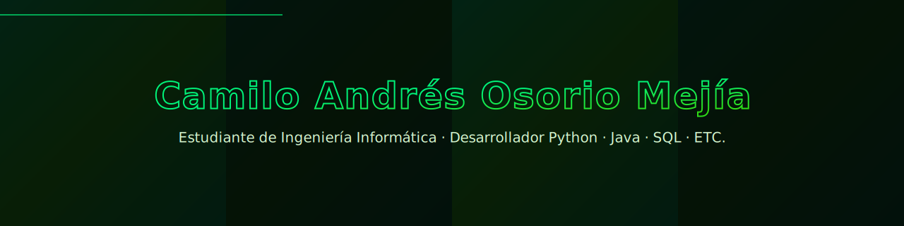

<!-- Banner -->

  

<h1 align="center" style="margin-top: -10px">👋 Hola — soy <strong>Camilo Andrés Osorio Mejía</strong></h1>

  <strong>Estudiante de Ingeniería Informática · Desarrollador Python · Java · JavaScript · Kotlin · SQL</strong> 
  Construyo bots, apps Android (ChibiFlix), videojuegos 2D y soluciones BI — con enfoque en código limpio y producto funcional.

  
  
  

---

## 🧠 Sobre mí
Soy estudiante de Ingeniería Informática con enfoque en desarrollo práctico. Me especializo en proyectos que van desde **bots y automatizaciones** hasta **apps móviles** y **modelado de datos**. Me encanta resolver problemas con soluciones simples y escalables.

---

## 🔭 Actualmente
- Manteniendo y mejorando **KaiVoxx** (bot de música en Python) — versión pública en mi cuenta.  
- Integrando y puliendo **ChibiFlix** (Android, Kotlin) — en progreso.  

---

## 🚀 Proyectos públicos (en mi GitHub)
- **[KaiVoxx](https://github.com/CamiloOsorio07/KaiVoxx)** — Bot de música en Python (YouTube, SoundCloud/Deezer, fallbacks).  
- **BOT-KaiVoxx** — Otra versión / fork del bot (Python).  
- **Bot-DC** — Bot de Discord (Python).  
- **ChibiFlix** — App Android en Kotlin (API Jikan).  
- **Proyectos académicos** — juegos con Construct, ejercicios Java/Kotlin, prácticas y demos.

---

## 🛠️ Tech stack
**Lenguajes:** Python · Java · JavaScript · Kotlin · SQL · HTML5 · CSS3  
**Bases de datos / BI:** PostgreSQL · MySQL · ETL / SCD Tipo 2  
**Herramientas y frameworks:** Android Studio · pgAdmin4 · Docker · GitHub Actions · VS Code · Discord.py · Pygame

---

## 📈 Mis estadísticas (verdes)

  

  

  

---

## 🎯 Objetivo profesional
Busco prácticas o mi primer empleo en desarrollo de software. Quiero contribuir en equipos con buenas prácticas, pruebas y CI/CD, mientras sigo aprendiendo y aportando.

---

## 📫 Contacto
- Email: `camiloosorio717@gmail.com`  
- GitHub: https://github.com/CamiloOsorio07  
- LinkedIn: (por añadir)

---

✨  Construir · Aprender · Mejorar continuamente

